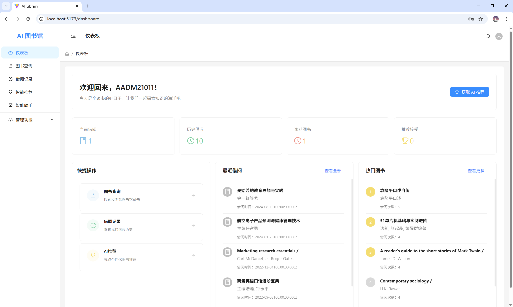
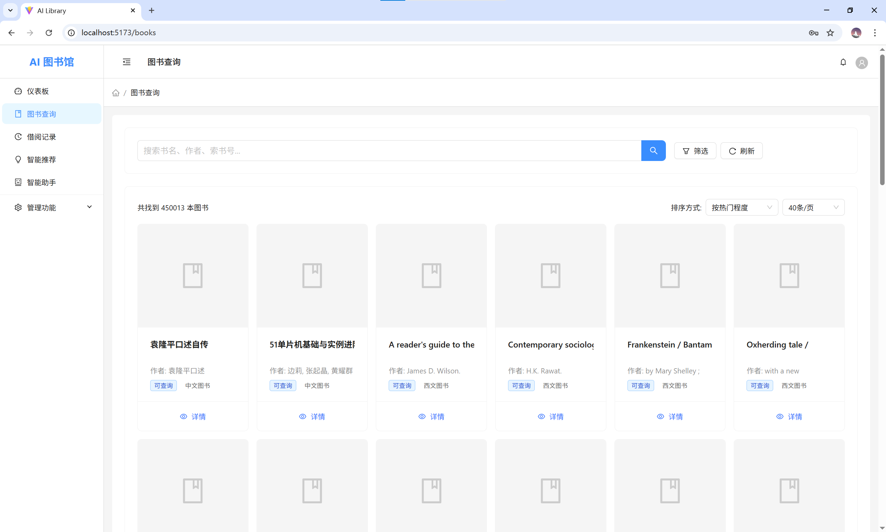
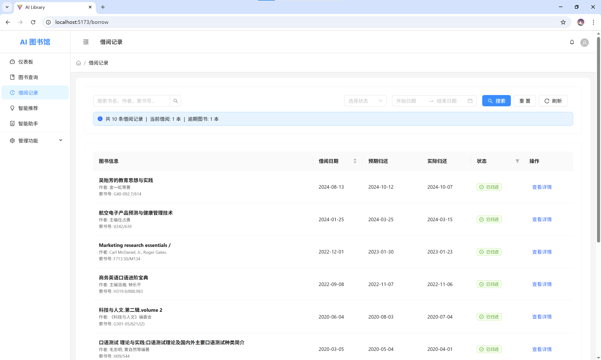
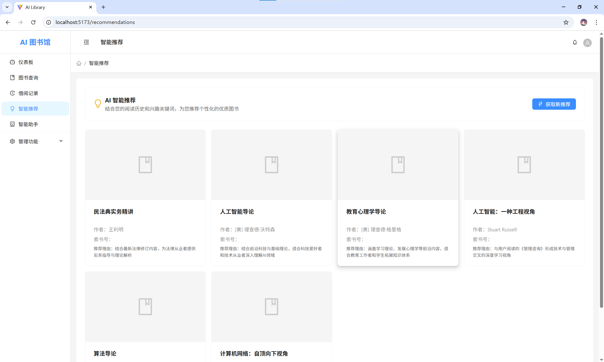
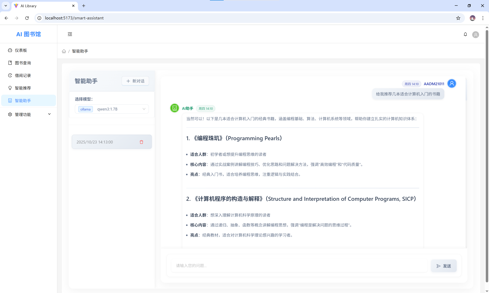
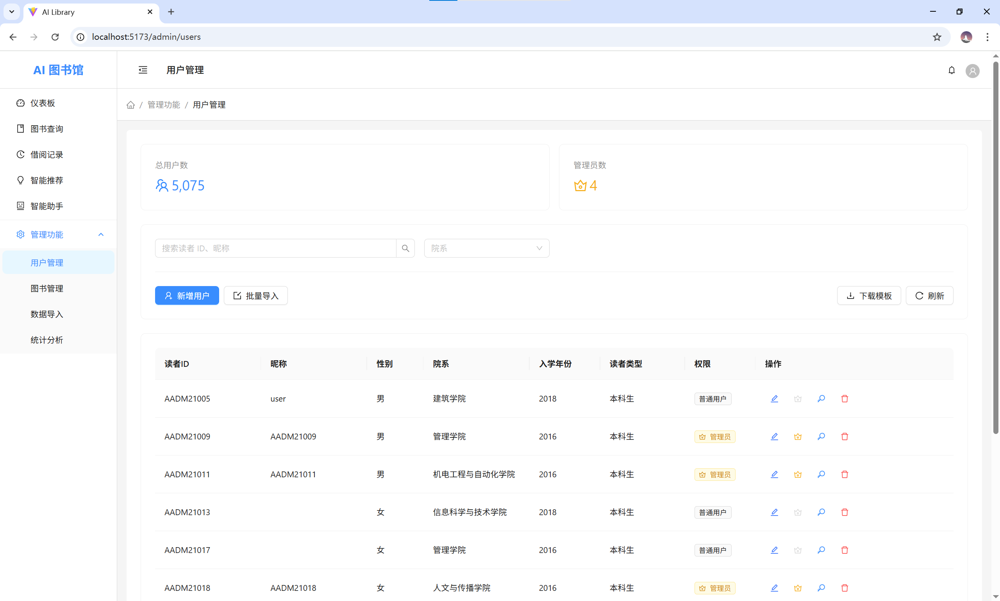
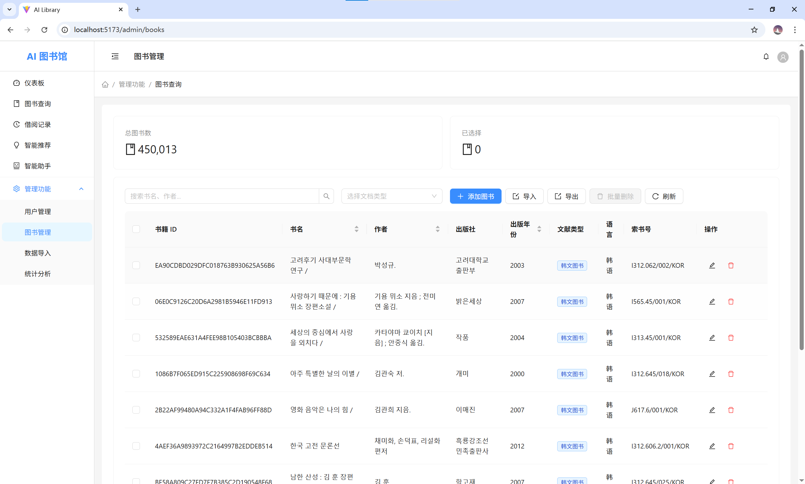
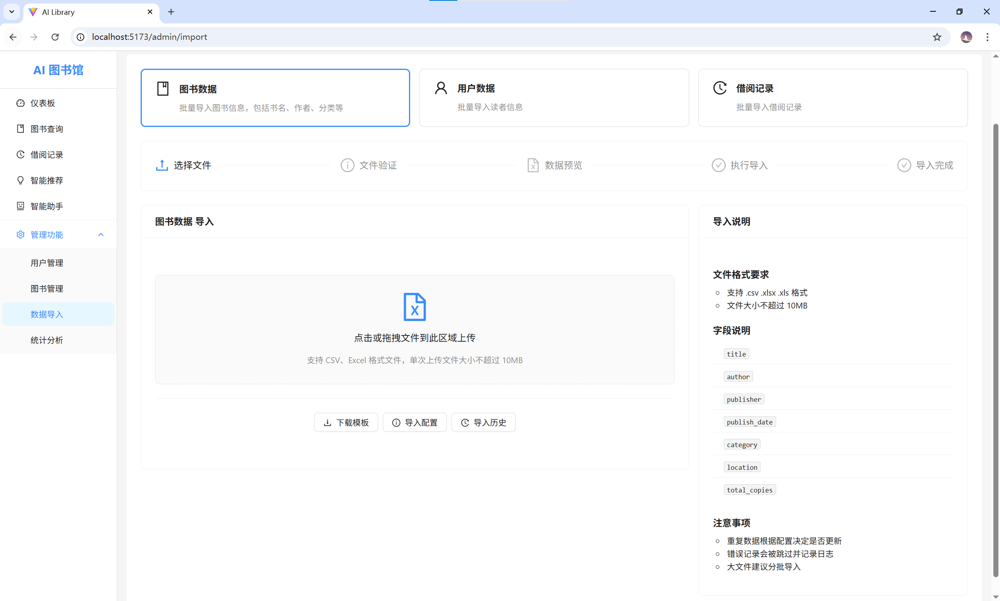
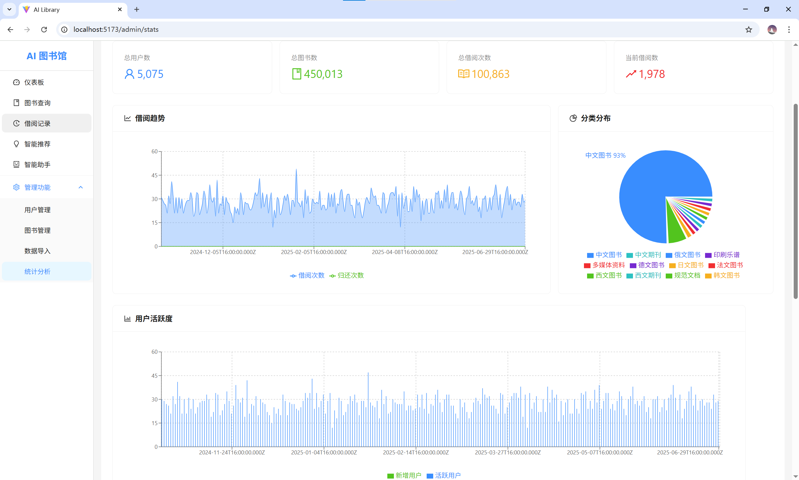

# AI-Library

本项目是由 React 与 Express 提供前后端支持，由 Ollama 本地运行提供模型驱动的具有智能推荐、智能助手等功能的智能图书馆管理系统，旨在将人工智能技术融入图书借阅和管理流程中。

项目主体为 Web 应用，且支持用户认证、图书检索、借阅管理等功能，并集成了由 AI 驱动的个性化图书推荐和智能问答助手。

## 核心功能

- 用户认证：安全的登录和注册功能。
- 图书管理：管理员可以轻松添加、更新和删除图书信息。
- 借阅系统：用户可以在线浏览已入库图书，并查看自己的借阅历史。
- AI 图书推荐：根据用户的借阅历史和偏好，利用 AI 算法为用户提供个性化的图书推荐。
- AI 智能助手：一个集成的 AI 回答助手，可以回答用户对于图书、科技等各种问题。
- 管理面板：为图书管理员提供专门的管理面板，如图书借阅统计、用户活动等。

## 技术栈简介

本项目采用前后端分离的架构，并包含一个独立的 Python 核心服务，主要技术栈如下所示：

```
AI-Library/
├── backend/        # Node.js 后端服务
├── core/           # 数据分析与 AI 驱动服务
└── frontend/       # React 前端应用
```

- 前端 (Frontend)
  - 框架: React
  - 构建工具: Vite
  - UI 库: Ant Design

- 后端 (Backend)
  - 框架: Express.js
  - 数据库: PostgreSQL
  - 认证: JWT

- 数据分析与 AI 驱动 (Core)
  - 框架: Flask
  - AI 驱动: Ollama / Gemini

## 开始使用

### 环境准备

1.  Clone 项目:

    ```bash
    git clone https://github.com/isiou/AI-Library.git
    cd AI-Library
    ```

2.  环境配置:
    - 后端: 复制 `backend/.env.example` 为 `backend/.env` 并配置环境变量。
    - 前端: 根据需要配置 `frontend/.env`。

### 本地开发

1.  启动后端服务:

    ```bat
    cd backend
    npm install
    npm run dev
    ```

2.  启动前端应用:

    ```bat
    cd frontend
    npm install
    npm run dev
    ```

3.  启动 Core 服务:

    ```bat
    cd core
    python -m venv .venv
    .venv\Scripts\activate
    pip install -r requirements.txt
    python app.py
    ```

4.  配置 Ollama 服务:

    > 若未安装 Ollama 请先下载安装。

    根据 `core\config.py` 中的模型配置，启动本地 Ollama 并运行：

    ```bat
    ollama run [模型版本]
    ```

## 页面预览

### 普通用户












### 管理员用户








