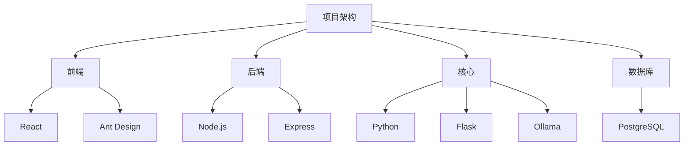

# AI 智能图书馆系统

## 1. 项目概述

AI 智能图书馆（AI-Library）主体是一个具有现代化页面的 Web 应用，旨在将人工智能技术融入传统的图书馆管理和读者服务流程。项目核心是构建一个集图书管理、借阅流程、AI 个性化推荐和 AI 智能问答助手于一体的综合性平台。

此系统不仅提供了标准在线图书馆所需的用户认证、图书检索、借阅管理等基础功能，更通过集成本地大型语言模型（LLM），为用户带来了独特的智能化、个性化阅读体验。管理员则可以通过专属的管理面板，高效地进行用户管理、图书维护、数据导入和数据洞察，从而提升管理效率。

> 项目演示地址: [https://www.isiou.top](https://www.isiou.top)
>
> **注: 若需尝试 AI 相关功能，可提前联系作者 [19905616375]，由于服务器性能较差，目前 Ollama 调用采用 frp 穿透技术进行端口暴露，若作者主机未启动 frpc 服务端 AI 功能将暂不可用！**
>
> 测试管理员: { "user": "ROOT", "password": "rootuser" }
>
> 测试读者: { "user": "PCSCS19096", "password": "PCSCS19096" }

> 项目仓库地址: [Gitee](https://gitee.com/isiou/ai-library-online) 或 [Github](https://github.com/isiou/ai-library-online)
>
> 部署过程参考: [AI-Library_Deploy.md](AI-Library_Deploy.md)

## 2. 需求分析

本项目旨在解决传统图书馆在数字化时代面临的多重挑战：

- 信息过载与发现困难：读者面对海量馆藏，难以快速找到符合个人兴趣和需求的“下一本好书”。
- 服务模式单一：传统的咨询服务依赖人工和读者自行查找，响应速度和知识广度有限，无法满足读者多样化、即时性的信息需求。
- 管理效率低下：图书管理员在数据统计、用户行为分析等方面缺少智能化工具，对馆藏的管理、读者的需求解决仍以经验为主。
- 用户体验不佳：传统图书馆主要依赖于人工，用户需往返于图书馆进行咨询或查询操作，且无法获得对某些问题的解答。

## 3. AI 技术应用方案

为了应对上述挑战，本项目设计了两大核心 AI 功能：**智能推荐系统** 与 **AI 智能助手**。

### 3.1. 智能推荐系统

智能推荐系统是本项目的亮点之一，它采用了一种 **AI 模型与数据库混合驱动** 的策略，确保服务的稳定性和高质量。

- **推荐逻辑**：
  1. **数据驱动**：系统首先通过数据库查询获取用户最近的阅读记录，首先刻画用户画像，构建可能感兴趣的内容。
  2. **提示词工程**：根据用户的历史偏好和用户提供的 **关键词**，动态构建一个结构化的、高质量的 Prompt。该 Prompt 将指导 AI 模型扮演一位专属于用户的 **经验丰富的图书管理员** 角色。
  3. **AI 模型调用**：将构建好的 Prompt 与本地部署的 **Ollama** 本地模型服务进行交互。模型将根据提示词与命令，生成一个专属于读者的、详细的、结构化的推荐列表。
  4. **结果解析与持久化**：后端服务解析大模型返回的数据列表，结构化后在前端进行展示，并将其格式化后持久化保存到用户数据库内，用于后续分析和历史追溯。

- **弹性回退机制**：
  - 为了保证在大模型服务在不可用或响应超时的情况下，推荐功能依然可用，系统设计了弹性回退机制。
  - 当大模型推荐响应失败时，系统会自动切换到 **基于数据库的协同过滤** 逻辑：分析用户的借阅历史（如作者、分类），从已入库的数据中查询相似或热门的书籍作为替代推荐。

### 3.2. AI 智能助手

AI 智能助手为用户提供了一个交互式的聊天界面，能够回答用户关于图书、知识、甚至编程等各类问题。

- **技术实现**：
  1. **会话管理**：后端负责创建和管理用户的聊天会话，并将所有对话历史持久化保存到数据库中。
  2. **模型选择**：用户可以在前端根据自己的喜好，选择不同的 Ollama AI 模型（如 `Qwen` `gpt-oss` `gemini` 等），后端根据用户的喜好调用相应的模型服务。
  3. **流式响应**：为了提供最佳用户体验，后端采用了 **Server-Sent Events** 响应模式。当大模型生成回答时，后端会以 **打字机** 的形式，将内容一字一句地实时推送到前端，用户无需等待模型生成完整回答，极大地降低了感知延迟，并且避免了长时间等待模型回答的枯燥。
  4. **Markdown 渲染**：大模型的回答支持 Markdown 格式，前端能够解析并渲染出格式丰富的文本，如代码块、列表、引用等，提升了信息的可读性与页面的美观性。

## 4. 项目创新点

1.  **本地化 LLM 驱动**：项目主要依赖 **Ollama** （且并不唯一依赖，后期若自主训练模型可以进行接入自有模型或采用在线 API 等，本项目中预留了 Gemini 的接口）在本地环境中运行开源大语言模型。这不仅显著降低了对商业 API 的依赖和成本，更重要的是保证了用户数据的 **隐私安全** 与 **可扩展性**，所有交互数据均保留在本地服务器内，确保了不会存在数据泄露、隐私安全等问题。

    > 另外，由于是基于本地模型，后期若有需要可以进行本地大模型的训练与应用，为图书馆单独训练一个具有 **庞大知识库（如图书资源位置、图书简介、图书馆服务引导等）、应用可行性的专属大模型**。这是目前较为前沿的人工智能应用技术，非常值得一试。

2.  **混合式推荐引擎**：创造性地结合了 AI 的高级语义理解能力与庞大知识范围，以及传统数据库的稳定性，构建了一个既智能又可靠的推荐系统。

3.  **前后端分离架构**：项目采用经典的前后端分离架构，同时将 Python 的数据处理和 AI 核心能力封装在独立的 `core` 服务中。这种设计不仅使职责划分清晰，也为未来将 `core` 模块扩展为独立的微服务奠定了基础。

4.  **强可扩展性**：项目的所有结构性、功能性的搭建仍具有非常强的可扩展性，以下列举部分将来可实现的内容。
    - 用户画像：可根据每一位读者或用户的习惯、兴趣，构建独属于用户自己的画像并持久化、可更新地保存下来，用于跟踪用户行为轨迹、阅读偏好、交互频率等多维度特征，从而提供更强大、贴切的个性化推荐与服务。画像系统可结合协同过滤、内容推荐及深度学习模型，实现动态演化与实时更新。
    - 大模型训练：可采用如 PyTorch、TensorFlow 等深度学习框架，根据已有的图书、标签、用户行为等资源构建高质量训练数据集，将数据喂给大语言模型（LLM）或专用模型。通过模型微调或提示词工程，实现智能问答、内容摘要、阅读理解、自动书评生成等功能，进一步提升平台的智能化水平。
    - 离散数据分析：可对用户在平台上的点击流、搜索记录、借阅行为（暂未接入）、停留时长等离散事件数据进行采集与建模，利用时间粒度分析、事件挖掘等技术，挖掘潜在行为模式与关联规则。

## 5. 技术路径与架构

项目整体采用三层架构：前端应用、后端服务和数据处理服务，且采用 PostgreSQL 作为存储数据库。

- **前端 (Frontend)**：基于 React 和 Vite 构建的 Web 应用，使用 Ant Design 作为 UI 组件库，Zustand 进行轻量级状态管理，通过 Axios 与后端进行 API 通信。
- **后端 (Backend)**：基于 Node.js 和 Express 框架构建的 API 服务。负责处理业务逻辑，连接 PostgreSQL 数据库进行查询和存库，并作为客户端调用 Ollama 服务。
- **核心 (Core)**：一个独立的 `Python/Flask` 服务，封装了数据清洗、查询和 AI 推荐的备用逻辑。它与后端服务解耦，可以独立部署和扩展。

## 6. 技术栈

- **前端**：
  - **框架**: React 19
  - **构建工具**: Vite
  - **UI 库**: Ant Design
  - **状态管理**: Zustand
  - **路由**: React Router
  - **HTTP 请求**: Axios

- **后端**：
  - **框架**: Node.js/Express.js
  - **数据库**: PostgreSQL
  - **认证**: JWT
  - **AI 集成**: Ollama

- **AI 核心**：
  - **框架**: Python/Flask
  - **AI 驱动**: Ollama

- **数据库**：
  - PostgreSQL

## 7. 总结

本项目构建了一个融合 AI 技术的现代化图书馆系统，在保障用户隐私与数据安全的前提下，通过本地部署的大语言模型实现了个性化图书推荐与智能问答服务。系统采用前后端分离架构，兼顾功能稳定性与技术前瞻性，并为未来的用户画像、行为分析和模型优化预留了良好的扩展接口。整体设计以实用为导向，旨在提升读者体验与管理效率，推动传统图书馆服务向智能化、个性化方向演进。
